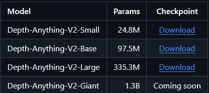

Instructions

https://github.com/DepthAnything/Depth-Anything-V2?tab=readme-ov-file#pre-trained-models 

Download one of the models from the link above. Put the model into the checkpoints directory.